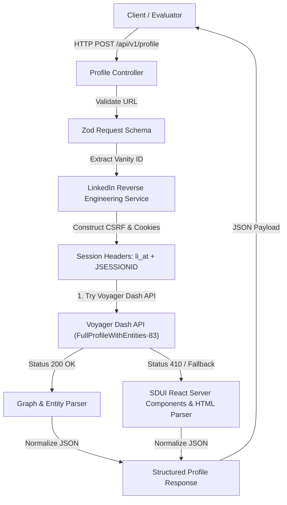

# ⚡ Reverse-Engineered LinkedIn Profile API

<div align="center">


A production-grade, hosted Node.js & TypeScript microservice built for the **Tross Hiring Challenge**. This API accepts any LinkedIn profile URL or vanity username and extracts structured JSON profile data by directly reverse-engineering LinkedIn's internal HTTP REST Voyager endpoints—**purely over HTTP, without browser automation tools** (no Puppeteer, Playwright, or Selenium).

</div>

---

## 🎨 Interactive Web Dashboard & Live Preview

When running locally or deployed over HTTPS, the root URL (`http://localhost:3000/`) serves a sleek, glassmorphism **Interactive Web Dashboard**:

- 🔍 **Instant Search**: Test any LinkedIn profile URL with visual profile rendering.
- 📊 **Dual Views**: Toggle between visual card UI and formatted raw JSON payloads.
- ⚡ **Presets**: One-click quick presets for testing (e.g. Satya Nadella, Bill Gates, Chaitanya Katore).

---

## 🏗️ System Architecture



---

## 🚀 Features

- ⚡ **Pure HTTP Reverse-Engineering**: Zero headless browser overhead. Direct HTTP calls to LinkedIn's private Voyager REST API.
- 🔒 **Dynamic CSRF & Header Emulation**: Automatically derives `csrf-token` from `JSESSIONID` and matches client browser security signatures.
- 📊 **Structured JSON Output**: Standardized Pydantic/Zod response schemas (Name, Headline, Location, Bio, Work Experiences, Education, Skills, Certifications, and Languages).
- 📘 **Interactive OpenAPI Docs**: Self-documenting Swagger UI served at `/docs`.
- 🖥️ **Built-in Web Dashboard**: Beautiful Glassmorphism Web UI served at `/`.
- 🛡️ **Zero Secret Leaks**: Configured strictly via environment variables (`.env`).
- 🐳 **Docker Containerization**: Multi-stage `Dockerfile` and `docker-compose.yml` for instant 1-click cloud deployment.

---

## 🛠️ Technical Approach & Reverse Engineering

### 1. Reverse-Engineering LinkedIn Voyager REST API
LinkedIn's web frontend relies on an internal REST interface known as the **Voyager API**. When a user views a profile on `linkedin.com`, the app queries endpoints such as:
```http
GET /voyager/api/identity/dash/profiles?q=memberIdentity&memberIdentity={vanity}&decorationId=com.linkedin.voyager.dash.deco.identity.profile.FullProfileWithEntities-83
```

### 2. Authentication & Header Signature
To communicate with LinkedIn's internal endpoints directly via HTTP:

- **`Cookie`**: `li_at=<YOUR_LI_AT_TOKEN>; JSESSIONID="<YOUR_JSESSIONID>"`
- **`csrf-token`**: Derived from `JSESSIONID` by stripping outer double quotes (e.g. if `JSESSIONID` is `"ajax:123456789"`, the `csrf-token` header value is `ajax:123456789`).
- **`x-restli-protocol-version`**: `2.0.0` (mandatory for RESTli graph normalization).
- **`accept`**: `application/vnd.linkedin.normalized+json+2.1, application/json`.
- **`User-Agent`**: Matches browser agent string from which session cookies were copied.

### 3. SDUI & React Server Component Stream Parser
If Voyager REST endpoints return stream chunks or fallback HTML payloads, the scraper parses embedded React Server Components (`window.__como_rehydration__` & `<code id="bpr-guid-...">` tags), isolating the main profile card from recommended sidebar profiles ("People Also Viewed").

---

## 📋 API Documentation & Endpoint Reference

### Endpoints
- **`POST /api/v1/profile`**: Returns profile data for JSON body `{ "url": "..." }`.
- **`GET /api/v1/profile?url=...`**: Returns profile data for query parameter.
- **`GET /docs`**: Interactive Swagger UI documentation.
- **`GET /`**: Web Dashboard.
- **`GET /health`**: Health check.

#### Sample Request (`POST /api/v1/profile`)
```bash
curl -X POST http://localhost:3000/api/v1/profile \
  -H "Content-Type: application/json" \
  -d '{"url": "https://www.linkedin.com/in/satyanadella/"}'
```

#### Sample Response (`200 OK`)
```json
{
  "success": true,
  "data": {
    "vanityId": "satyanadella",
    "profileUrl": "https://www.linkedin.com/in/satyanadella/",
    "fullName": "Satya Nadella",
    "firstName": "Satya",
    "lastName": "Nadella",
    "headline": "Chairman and CEO at Microsoft",
    "location": "Redmond, Washington, United States",
    "about": "As chairman and CEO of Microsoft, I define my mission and that of my company as empowering every person...",
    "profilePicture": "https://media.licdn.com/dms/image/...",
    "backgroundPicture": "",
    "experiences": [
      {
        "title": "Chairman and CEO",
        "companyName": "Microsoft",
        "locationName": "Greater Seattle Area",
        "startDate": "2014-2",
        "endDate": "Present",
        "description": ""
      }
    ],
    "education": [
      {
        "schoolName": "The University of Chicago Booth School of Business",
        "degreeName": "",
        "fieldOfStudy": ""
      },
      {
        "schoolName": "Manipal Institute of Technology, Manipal",
        "degreeName": "Bachelor’s Degree",
        "fieldOfStudy": "Electrical Engineering"
      }
    ],
    "skills": [],
    "certifications": [],
    "languages": []
  }
}
```

---

## ⚙️ Local Setup & Running

```bash
# 1. Clone repo
git clone https://github.com/your-username/linkedin-profile-api.git
cd linkedin-profile-api

# 2. Install dependencies
npm install

# 3. Configure environment variables
cp .env.example .env
# Fill in your LINKEDIN_LI_AT, LINKEDIN_JSESSIONID, and USER_AGENT

# 4. Start local development server
npm run dev

# 5. Run test suite
npm test
```

---

## 🐳 Docker Deployment

```bash
docker-compose up --build -d
```

## ⚠️ Known Limitations & Edge Cases

1. **Session Cookie Expiration**: LinkedIn `li_at` authentication cookies expire periodically (typically 6–12 months or upon active manual logout from browser). When expired, the API returns a clear `401 Unauthorized` response indicating that session tokens in `.env` need to be refreshed.
2. **Out-of-Network Profile Visibility**: Profiles with strict privacy settings set to "Private / Connections Only" will return public metadata (Name, Headline, Location, Photo) via the HTML fallback parser unless the authenticated account has visibility access to the profile.
3. **LinkedIn Rate Limiting (HTTP 429)**: Making thousands of rapid sequential requests from a single IP address without rotation may trigger LinkedIn's IP rate limiter (`HTTP 429`). For high-throughput production deployment, proxy rotation or multi-token pool rotation is recommended.

---

## 📄 License

MIT
